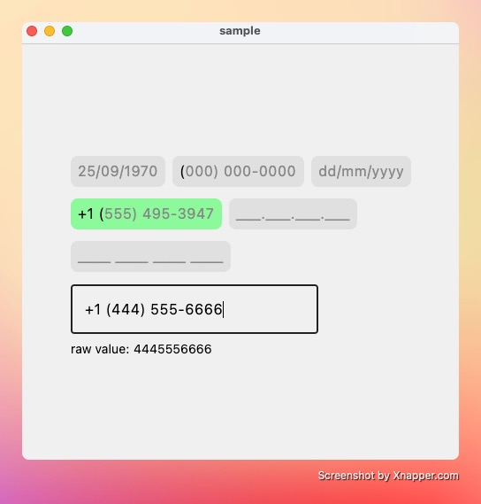
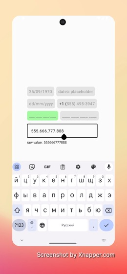
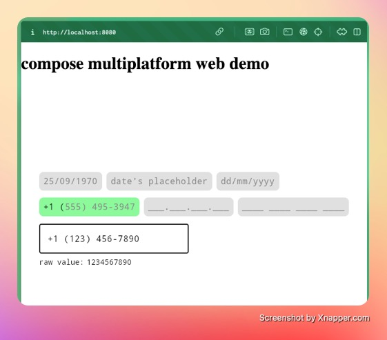
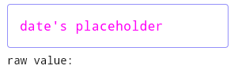
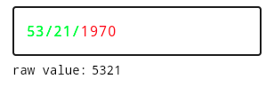

[](https://github.com/3moly/compose-input-mask/releases/latest)
[](https://github.com/3moly/compose-input-mask/releases)


# input-mask library for compose multiplatform 
This is a small project to bring a few functions that solve an input-mask problem in compose. 
There is already added one implementation for demo in compose: **PasswordVisualTransformation**, but this is **not enough**. If you already knew what it costs to bring your own mask for your compose-project, **this project can help you**.

support targets: `android`, `ios`, `desktop` and `js`.

<p align="center">
  
   
</p>

<p align="center">
  
</p>

#### features

* placeholder
* styling text

# install

``` kotlin
allprojects {
  repositories {
    mavenCentral()
  }
}

dependencies {
    implementation("io.github.3moly:compose-input-mask:x.x.x")
}
```

# how to use

Here is example of using TextFields in Jetpack Compose. And the one missing part is visualTransformation parameter.

``` kotlin
val textFieldState = remember { mutableStateOf(TextFieldValue("")) }
OutlinedTextField(
    value = textFieldState.value,
    onValueChange = { newValue ->
        textFieldState.value = newValue
    },
    visualTransformation = visualTransformation,
    singleLine = true
)
```

Let's write a mask for date like this "dd/mm/yyyy".

``` kotlin
val visualTransformation = universalTransformation(
    mask = "dd/mm/yyyy",
    maskCharToKeep = '/'
)
```

| input       | display result | raw value in return (newValue ->) |
|-------------|----------------|-----------------------------------|
| 11          | 11/mm/yyyy     | 11                                |
| 11012001    | 11/01/2001     | 11012001                          |
| 112233334   | 11/22/3333     | 112233334                         |
| my_birthday | my/_b/irth     | my_birthday                       |

### current restrictions
Because we use compose class VisualTransformation, there is no chance to change the raw value. In a 1.x.x version you need to filter text (ex: for only numbers or for length size) on your own before passing text to OutlinedTextField or other @Composable text fields.

//here is date's onValueChange. Max length of text: 8, only digits.
``` kotlin
onValueChange = { newValue ->
    val filteredText = newValue.text.filter { d -> d.isDigit() }.take(8)
    textFieldState.value = newValue.copy(text = filteredText)
},
```

### placeholder

``` kotlin
val visualTransformation = universalTransformation(
    mask = "dd/mm/yyyy",
    maskCharToKeep = '/',
    placeholder = "date's placeholder"
)
```

### styling text

Here is a class for passing him in a parameter of universalTransformation:

``` kotlin
@Stable
data class MaskStyle(
    val placeholderColor: Color,
    val beforeCursorColor: Color,
    val afterCursorColor: Color
) {
    companion object {
        val Default = MaskStyle(
            placeholderColor = Color.Gray,
            beforeCursorColor = Color.Black,
            afterCursorColor = Color.Gray
        )
    }
}
```

If we pass the object of MaskStyle like this:

``` kotlin
placeholder = "date's placeholder",
style = MaskStyle(
    placeholderColor = Color.Magenta,
    beforeCursorColor = Color.Green,
    afterCursorColor = Color.Red
)
```
##### result:




<details>

<summary>tools</summary>

###### commands to run samples 

desktop: `./gradlew :sample:run`

wasmJs: `./gradlew :sample:wasmJsRun`

###### other commands 

get new versions: `./gradlew :refreshVersions`

</details>